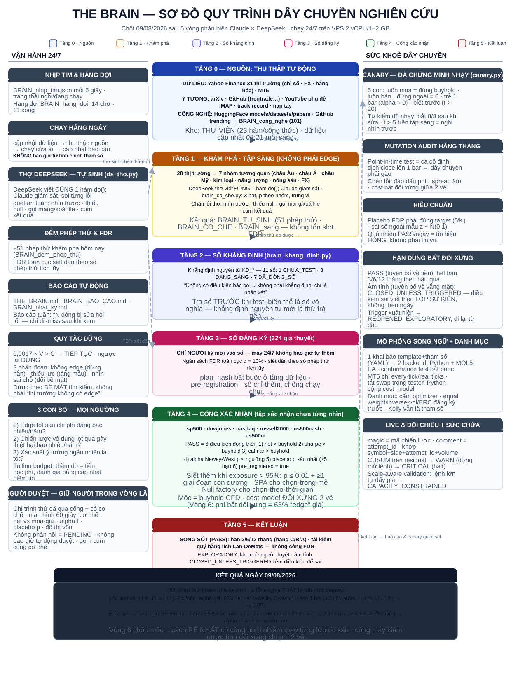
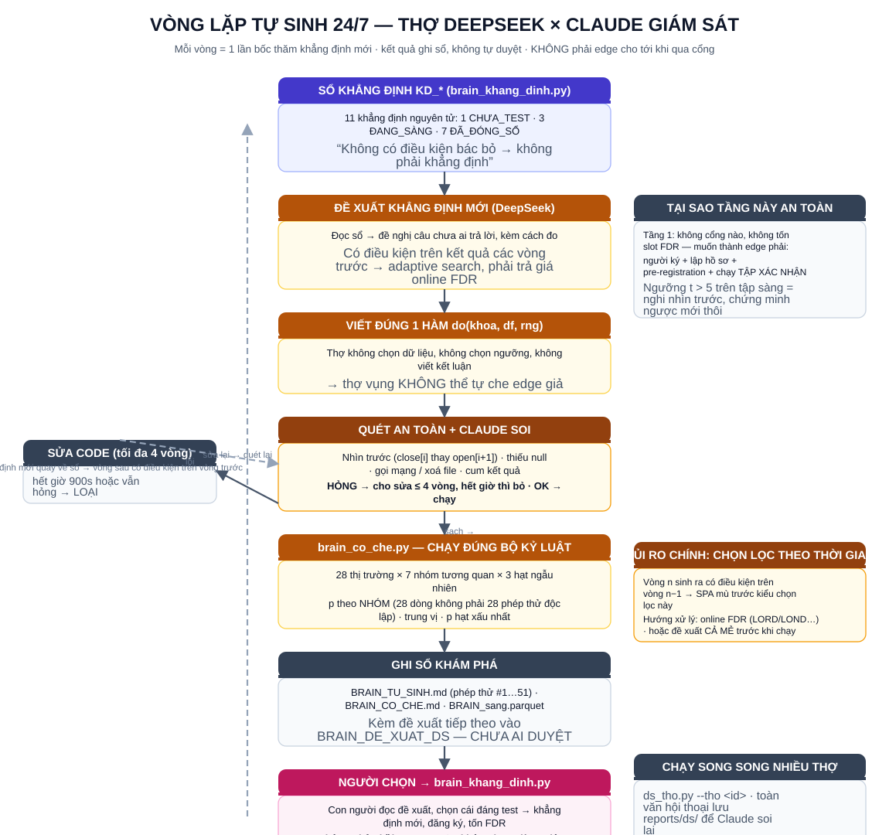
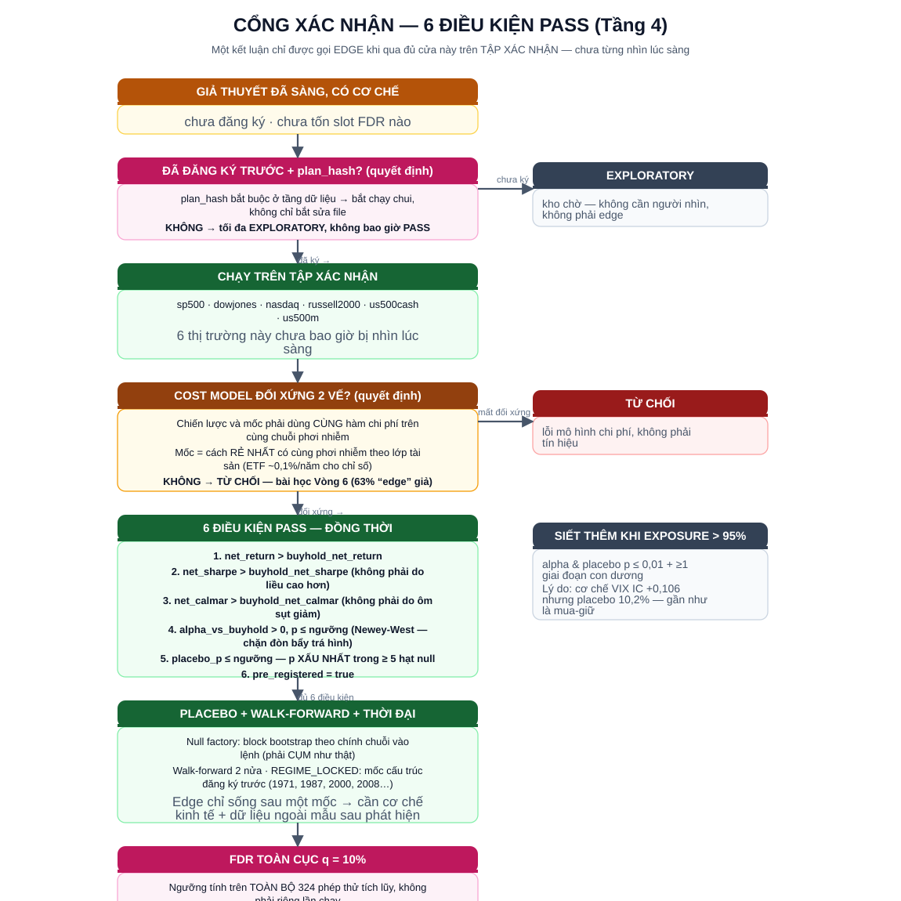
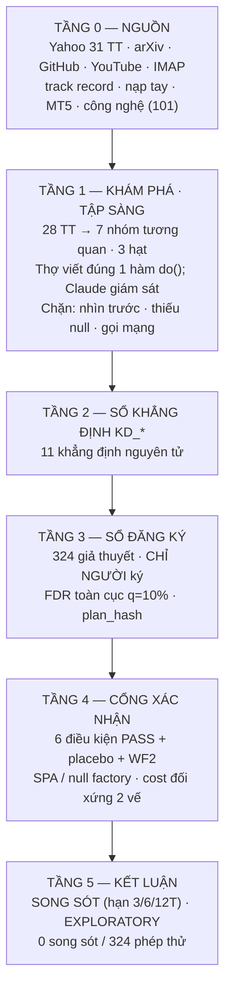

# THE BRAIN — SƠ ĐỒ QUY TRÌNH

*Cập nhật 09/08/2026 · chốt sau 5 vòng phản biện Claude × DeepSeek (`THIET_KE_DAY_CHUYEN.md`) · chạy 24/7 trên VPS 2 vCPU / 1–2 GB*

## Sơ đồ (ảnh SVG — mở bằng trình duyệt)

| Sơ đồ | Ảnh | SVG gốc |
|---|---|---|
| 1 · Tổng quan dây chuyền |  | `so_do/so_do_tong_quan.svg` |
| 2 · Vòng lặp tự sinh 24/7 |  | `so_do/so_do_vong_lap.svg` |
| 3 · Cổng PASS (6 điều kiện) |  | `so_do/so_do_cong_pass.svg` |

Mở nhanh: gấp đôi click `so_do/SO_DO_THE_BRAIN.html` (bản tối, đủ 3 sơ đồ) hoặc mở 3 file `.png` trong `so_do/`.

---

## Sơ đồ 1 — Tổng quan dây chuyền (văn bản)

```
                ┌───────────────────────────────────────────────┐
                │ TẦNG 0 — NGUỒN: Yahoo 31 TT · arXiv · GitHub  │
                │ YouTube · IMAP · track record · nạp tay · MT5  │
                │ Công nghệ: HuggingFace/GitHub trending (101)   │
                └──────────────────────┬────────────────────────┘
                                       ▼
                ┌───────────────────────────────────────────────┐
                │ TẦNG 1 — KHÁM PHÁ · TẬP SÀNG (KHÔNG phải edge) │
                │ 28 thị trường → 7 nhóm tương quan · 3 hạt      │
                │ Thợ DeepSeek viết đúng 1 hàm do(); Claude soi  │
                │ Chặn: nhìn trước · thiếu null · gọi mạng/cum   │
                └──────────────────────┬────────────────────────┘
                                       ▼
                ┌───────────────────────────────────────────────┐
                │ TẦNG 2 — SỔ KHẲNG ĐỊNH KD_* (11: 1 chưa test,  │
                │ 3 đang sàng, 7 đã đóng sổ)                     │
                └──────────────────────┬────────────────────────┘
                                       ▼ (người ký)
                ┌───────────────────────────────────────────────┐
                │ TẦNG 3 — SỔ ĐĂNG KÝ: 324 giả thuyết · CHỈ NGƯỜI│
                │ ký · FDR toàn cục q=10% siết dần · plan_hash   │
                └──────────────────────┬────────────────────────┘
                                       ▼ (chạy cổng)
                ┌───────────────────────────────────────────────┐
                │ TẦNG 4 — CỔNG XÁC NHẬN (tập xác nhận 6 TT chưa │
                │ từng nhìn): 6 điều kiện PASS + placebo + WF2 + │
                │ SPA/null factory + cost model đối xứng 2 vế    │
                └──────────────────────┬────────────────────────┘
                                       ▼
                ┌───────────────────────────────────────────────┐
                │ TẦNG 5 — KẾT LUẬN: SONG SÓT (hạn 3/6/12 tháng) │
                │ · EXPLORATORY · CLOSED_UNLESS_TRIGGERED        │
                │ Hiện tại: 0 song sót / 324 phép thử            │
                └───────────────────────────────────────────────┘
```

## Sơ đồ 2 — Vòng lặp tự sinh 24/7

```
Sổ khẳng định KD_* → Đề xuất khẳng định mới (DeepSeek)
   → Viết đúng 1 hàm do(khoa, df, rng)
   → Quét an toàn + Claude soi (HỎNG → sửa ≤ 4 vòng → bỏ)
   → brain_co_che.py: 28 TT × 7 nhóm × 3 hạt · p theo nhóm
   → Ghi BRAIN_TU_SINH / BRAIN_CO_CHE / BRAIN_sang (+51 hôm nay)
   → BRAIN_DE_XUAT_DS (chưa ai duyệt)
   → NGƯỜI chọn → brain_khang_dinh → đăng ký, tốn FDR
   ↑_____________________ vòng sau (adaptive search) ________________│
```

## Sơ đồ 3 — Cổng PASS (6 điều kiện)

```
Giả thuyết đã sàng → Đăng ký trước + plan_hash? —KHÔNG→ EXPLORATORY
   → Tập xác nhận (6 TT chưa từng nhìn)
   → Cost model đối xứng 2 vế? —KHÔNG→ TỪ CHỐI (bài học Vòng 6)
   → 6 điều kiện PASS đồng thời:
       1. net_return > buyhold_net_return
       2. net_sharpe > buyhold_net_sharpe
       3. net_calmar > buyhold_net_calmar
       4. alpha Newey-West p ≤ ngưỡng (chặn đòn bẩy trá hình)
       5. placebo p xấu nhất trong ≥ 5 hạt
       6. pre_registered = true
   → Placebo + walk-forward 2 nửa + REGIME_LOCKED
   → FDR toàn cục q = 10% (trên 324 phép thử tích lũy)
   → SONG SÓT (hạn 3/6/12 tháng · tái kiểm quý Lan-DeMets)
```

---

## Bản Mermaid (mở trong VS Code / GitHub / Obsidian)



## Tóm tắt một ngày làm việc — 09/08/2026

- **08:21–09:16** — Chạy định kỳ sáng: cập nhật dữ liệu, thu thập nguồn, cửa ải (0 song sót/324), chạy tầng sàng 7 cơ chế (Elliott, SMC, Wyckoff, Gann) trên 28 thị trường → `BRAIN_CO_CHE.md`.
- **08:52–17:13** — Vòng lặp tự sinh: thợ DeepSeek tạo **51 phép thử khám phá** (SMC, chu kỳ thời gian, VSA, khối lượng, Elliott…) → `BRAIN_TU_SINH.md`, `BRAIN_DE_XUAT_DS.md`.
- **09:57** — Cập nhật sổ khẳng định: 11 KD_* (1 chưa test, 3 đang sàng, 7 đã đóng sổ).
- **15:21–15:27** — Chạy thử nhiều chiến lược (freqtrade GPL-3.0) → phát hiện **2 lỗi engine thật**: phí qua đêm bất đối xứng (~2%/năm alpha giả) và lệch 1 bar (+26,8%/năm) — bị bắt nhờ con số quá đẹp; **canary.py + canary_kiem_do_nhay.py** dựng xong, chứng minh nhạy 8/8.
- **15:27** — Chốt bản gộp thiết kế dây chuyền sau 5 vòng phản biện (`THIET_KE_DAY_CHUYEN.md`): 2 loại alpha, cổng 6 điều kiện, SPA + null factory, phi dừng thời đại, hạn dùng bất đối xứng, mutation audit, quy tắc dừng, tuition budget, mô phỏng song ngữ.
- **16:58–17:19** — Chốt thêm 8 cơ chế cuối (tổng 51 phép thử), đo chi phí giữ vị thế trên MT5 thật (`BRAIN_CHI_PHI.md`: chênh tới 5,5%/năm giữa các sàn), cập nhật báo cáo vòng lặp, nhịp tim + hàng đợi (14 chờ / 11 xong).
- **Kết luận chính**: 0 edge qua 324 phép thử là âm tính hợp lệ; giá trị thật hôm nay nằm ở **phát hiện chi phí** (alpha phép trừ) và **bộ cổng/canary** bắt được 2 lỗi nghiêm trọng mà trực giác người đã bỏ lỡ.
